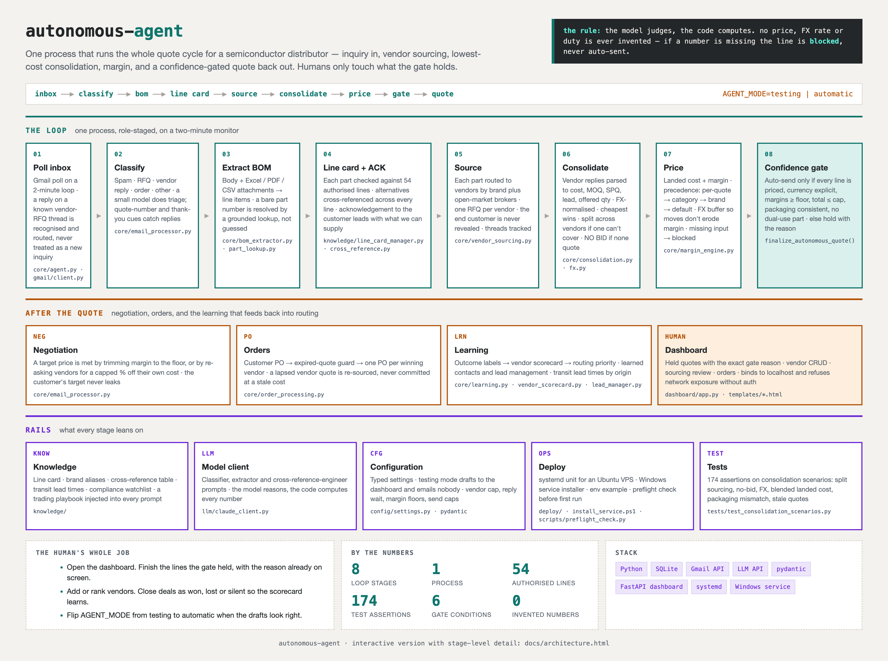

# autonomous-agent

One process that runs the whole quote cycle for a semiconductor distributor. A customer inquiry arrives by email; the agent classifies it, extracts the bill of materials, checks the line card, sources every part from vendors, consolidates the cheapest cover, prices it with margin, and sends the quote back - if, and only if, a confidence gate passes. Anything the gate holds lands on a dashboard with the exact reason, and a human finishes that line.

Built and run for a Singapore-based international sales desk, quoting in USD. Company identity, mailbox, vendor seeds and the live database are replaced with placeholders in this copy; the code is otherwise as deployed.



> **The rule.** The model judges, the code computes. No price, FX rate or duty is ever invented. If a number is missing, the line is `blocked` and never auto-sent.

Interactive version with stage-level detail: [docs/architecture.html](docs/architecture.html). Operations runbook: [HOW-TO-RUN.md](HOW-TO-RUN.md).

## By the numbers

| | |
|---|---|
| Python | ~10,200 lines across 41 files |
| Loop | 8 stages, 1 process, 2-minute monitor |
| Line card | 54 authorised lines, plus open-market brokers |
| Tests | 174 assertions on consolidation scenarios |
| Confidence gate | 6 conditions, every one logged when it holds |
| Invented numbers | 0 |

## The loop

1. **Poll inbox.** Gmail on a two-minute loop. A reply on a known vendor-RFQ thread is recognised and routed, never mistaken for a new inquiry.
2. **Classify.** Spam, RFQ, vendor reply, order, other. A small model does triage; quote-number and thank-you cues catch replies.
3. **Extract BOM.** Email body plus Excel, PDF and CSV attachments become line items. A bare part number is resolved by a grounded lookup, not guessed.
4. **Line card + acknowledgement.** Each part is checked against the authorised lines, alternatives are cross-referenced across every line, and the acknowledgement to the customer leads with what can be supplied.
5. **Source.** Each part is routed to vendors by brand plus open-market brokers, ranked by priority and learned score, capped per part. One RFQ per vendor. The end customer is never revealed.
6. **Consolidate.** Vendor replies are parsed to cost, MOQ, SPQ, lead time and offered quantity. Costs are FX-normalised and the cheapest wins. If the cheapest can't cover the quantity, the balance splits to the next and the line is priced at the blended landed cost. No quotes at all means `no_bid`.
7. **Price.** Landed cost plus margin, with precedence per-quote → category → brand → default. A buffer on FX so currency moves don't erode margin. Missing input means `blocked`.
8. **Confidence gate.** Auto-send only in automatic mode and only when every line is priced, the currency is explicit, every margin clears the floor, the total is under the cap, packaging is consistent, and no line is dual-use. Otherwise the quote is held with the reason.

## After the quote

- **Negotiation.** A target price is met by trimming margin to the floor, or by re-asking vendors for a capped percentage off their own cost. The customer's target never leaks to a vendor.
- **Orders.** Customer PO → expired-quote guard → one PO per winning vendor. A lapsed vendor quote is re-sourced, never committed at a stale cost.
- **Learning.** Outcome labels feed a vendor scorecard that feeds routing priority. Contacts and leads are learned from traffic.
- **Dashboard.** Held quotes with the gate reason, vendor management, sourcing review, order tracking. Binds to localhost and refuses network exposure without credentials.

## Rails

- **Knowledge.** Line card, brand aliases, cross-reference table, transit lead times by origin, a compliance watchlist for dual-use parts, and a trading playbook injected into every prompt.
- **Model client.** Classifier, extractor and cross-reference-engineer prompts. The model reasons; the code computes every number.
- **Configuration.** Typed settings. `AGENT_MODE=testing` drafts to the dashboard and emails nobody; `automatic` goes live. Caps on vendors per part, reply wait, margins, send value.
- **Deploy.** systemd unit for an Ubuntu VPS, a Windows service installer, an env example, a preflight check.

## Repository layout

```
main.py                 entry point: Gmail setup, dashboard, monitor loop
core/                   agent orchestrator, email processor, BOM extractor, sourcing,
                        consolidation, margin engine, FX, orders, learning, scorecard
knowledge/              line card, brand aliases, cross-reference, transit leads,
                        compliance watchlist, sales playbook
llm/                    model client and prompts
gmail/                  Gmail client
dashboard/ + templates/ FastAPI dashboard
config/                 typed settings
scripts/                vendor import, preflight, db utilities
tests/                  consolidation scenarios
deploy/                 systemd unit, VPS setup, env example
```

## Running it

```bash
pip install -r requirements.txt
cp deploy/ai-agent.env.example .env    # mailbox, LLM key, AGENT_MODE, margins, caps
python main.py --setup                 # mint the Gmail token on a machine with a browser
python scripts/preflight_check.py
python main.py                         # dashboard on the configured port
```

Start in `AGENT_MODE=testing`: every vendor RFQ goes to `VENDOR_TEST_EMAIL` or nowhere, and every quote drafts to the dashboard. Import vendors from `vendors_template.xlsx` via `scripts/import_vendors.py`. Flip to `automatic` when the drafts look right.

## What is not in this copy

The live database, the inbox study the playbook was distilled from, vendor seed data, the mailbox and company identity, and the Gmail token. All placeholders or env keys here.
